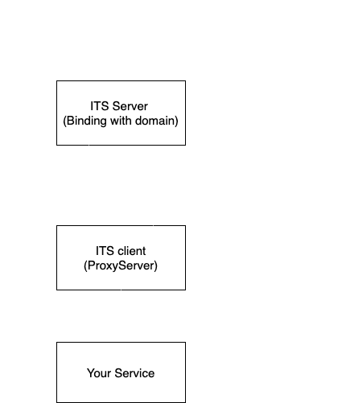

# IntrospectedTunnelsSocket

> Introspected Tunnel for localhost

- [structure](#structure)
- [Download](#download)
- [How to use](#how-to-use)

## Structure



## Download

### Linux

- server

```
curl -L https://github.com/skynocover/IntrospectedTunnelsSocket/releases/download/v0.0.3/itsServer_v0.0.3 > itsServer_v0.0.3
```


- client


```
curl -L https://github.com/skynocover/IntrospectedTunnelsSocket/releases/download/v0.0.3/itsClient_v0.0.3 > itsClient_v0.0.3
```

### MAC

- server

```
curl -L https://github.com/skynocover/IntrospectedTunnelsSocket/releases/download/v0.0.3/itsServerDar_v0.0.3 > itsServerDar_v0.0.3
```

- client

```
curl -L https://github.com/skynocover/IntrospectedTunnelsSocket/releases/download/v0.0.3/itsClientDar_v0.0.3 > itsClientDar_v0.0.3
```

### Windows

- server

```
curl -L https://github.com/skynocover/IntrospectedTunnelsSocket/releases/download/v0.0.3/itsServer_v0.0.3.exe > itsServer_v0.0.3.exe
```

- client

```
curl -L https://github.com/skynocover/IntrospectedTunnelsSocket/releases/download/v0.0.3/itsClient_v0.0.3.exe > itsClient_v0.0.3.exe
```

## How to use

### 1. Build itsServer

> set .env file

```
SERVER_LISTEN=80
DOMAINS=domain2.com,domain3.com
```

- SERVER_LISTEN: this is your port for listen request
- DOMAINS: these are your domain, you should add Aname record to the itsServer you running, itsServer will give these domain to your client

Run the itsServer on your VPS with domain

### 2. Run the itsClient on same place with your service

> set .env file

```
DOMAIN=http://domain.com
PROXY=http://localhost:3020
```

- DOMAIN: Your ITS Server Domain, client will connenct with socket to this URL
- PROXY: The URL your service running

### 3. Enjoy your tunnel
